# User Manual

## Introduction

This manual guides users through the modules, interfaces, and workflows of the **SRGE** system.

The left navigation bar lets you quickly switch between the following pages: **Home**, **Indicators**, **Calculation**, and **Templates**.

- **Home** is the landing page. It provides a brief overview of the system and entry points to the other modules.
- **Indicators** is the medical indicator management module, which ships with a set of built-in medical calculation indicators.
- **Calculation** is the main module and the primary workflow for end users.
- **Templates** displays the built-in atomic tool templates as reference information.

The sections below describe each module in detail.

## Home

As shown in the screenshot below, the **Home** page displays the system title, a short introduction, and entry points to the other modules. The **Documentation** button links to the system’s GitHub repository.

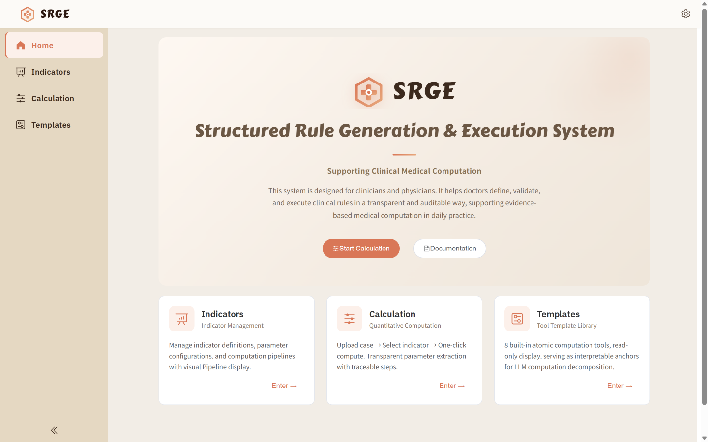

## Module 1: Indicators

The **Indicators** module is used to browse and manage medical calculation indicators. After entering the module, you will see a list of indicators and can search by name.

- Click **View** to inspect the detailed definition of an indicator, including its name, description, inputs and outputs, step sequence, and executable code.
- Click **Edit** to modify basic information such as the name and description.
- Click **Delete** to remove the corresponding indicator.

Click **New Indicator** in the upper-right corner to create an indicator. Enter the clinical question you want to calculate and a detailed description of how it should be calculated. After clicking **Submit**, the system automatically parses your input and creates a medical calculation indicator. When you return to the list, you will see the newly created indicator.

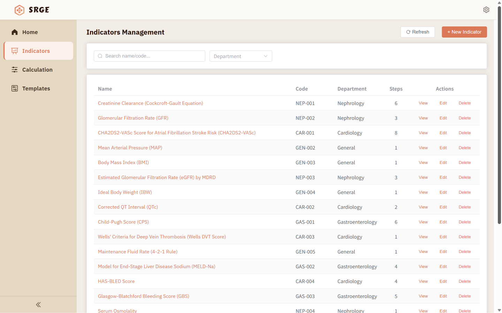

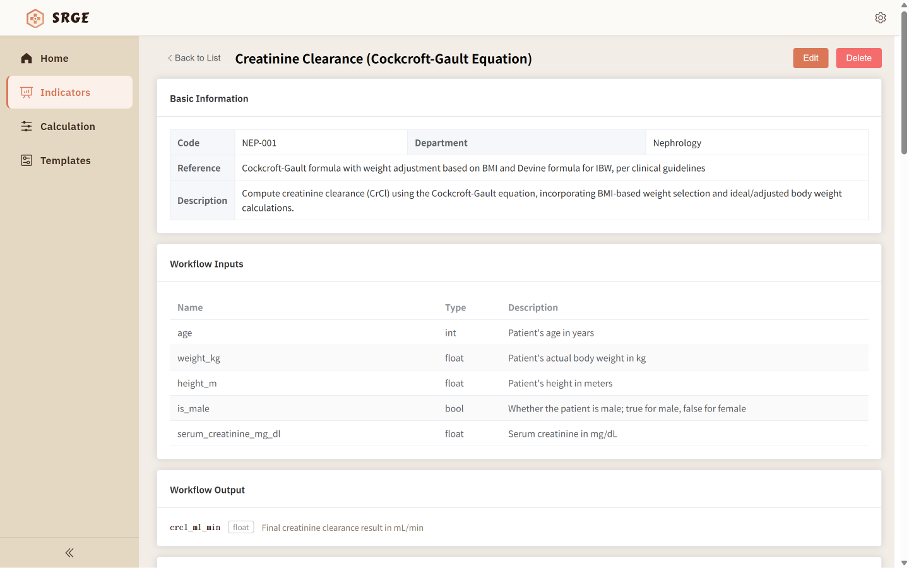

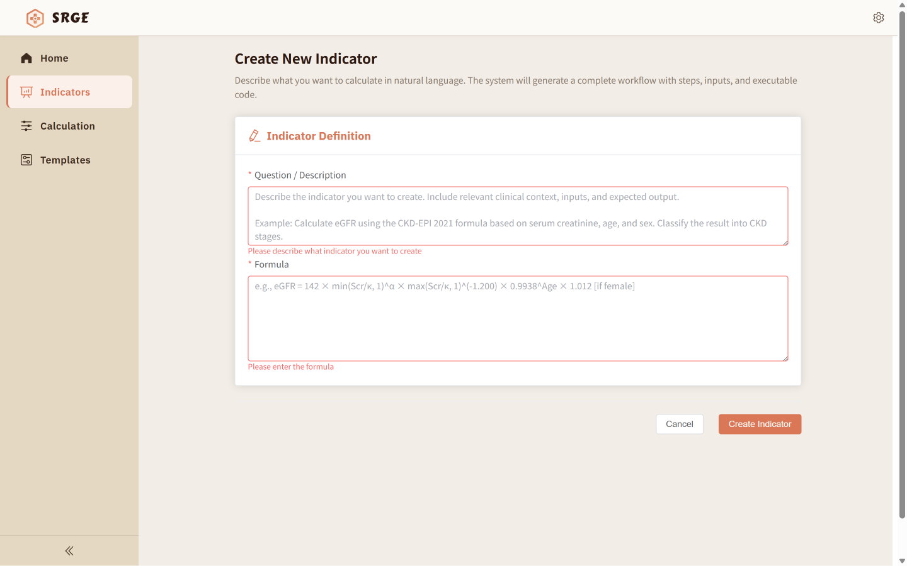

## Module 2: Calculation

The **Calculation** module is the main feature for end users. The workflow is: upload a case file, select the indicators to calculate, submit them, and view the results. The workflow is divided into three stages: **Upload Case**, **Select Indicators**, and **Results**. A progress bar at the top of the page shows the current stage.

### Upload Case

In the **Upload Case** stage, you need to upload an **EMR** (electronic medical record) file containing a single patient’s information. To make it easier to try the system, **Sample Files** provides several downloadable example records. After uploading, the case information is displayed on the page. Click **Replace Case** to choose a different file. After confirming, click **Submit**. The system parses the key case information and proceeds to the next stage.

### Select Indicators

In the **Select Indicators** stage, the system recommends **3–5** indicators suitable for the current case based on the parsed case data. You can select one of them. Alternatively, you can choose any indicator from the full library by clicking **Browse All Indicators**. In that case, the system cannot guarantee that the selected indicator is applicable to the current patient. “Applicable” means the key information required by the indicator is present in the uploaded EMR file. After selecting an indicator, click **Calculate** in the bottom-right corner to proceed to the **Results** stage.

### Results

In the final **Results** stage, the system loads the complete calculation rules for the selected indicator from the indicator library, extracts parameters from the case data, and performs a step-by-step calculation. It then presents the final result, including the parameters extracted from the original text and the intermediate steps.

- **Summary** panel: shows a concise conclusion so you can quickly obtain the final result.
- **Parameter Extraction** panel: displays the extracted parameters in a table and highlights them in the original text.
- **Indicator Result** panel: shows the final calculation result and the details of each sub-step, including the calculation logic, input parameters, and intermediate results, providing full traceability.

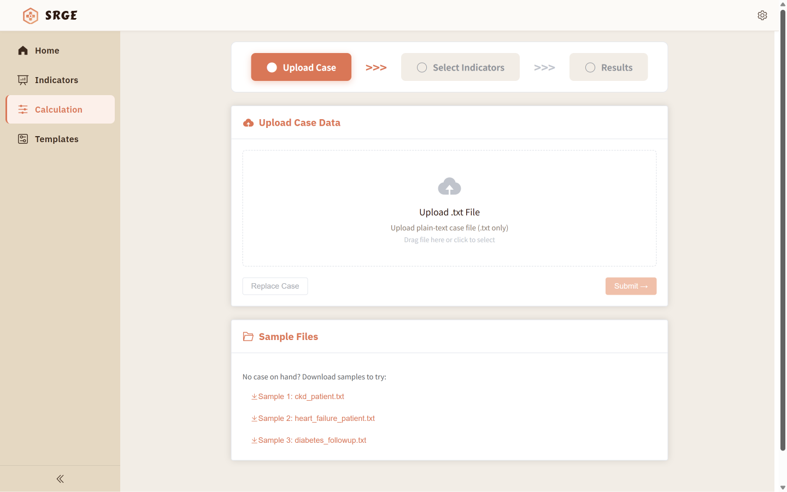

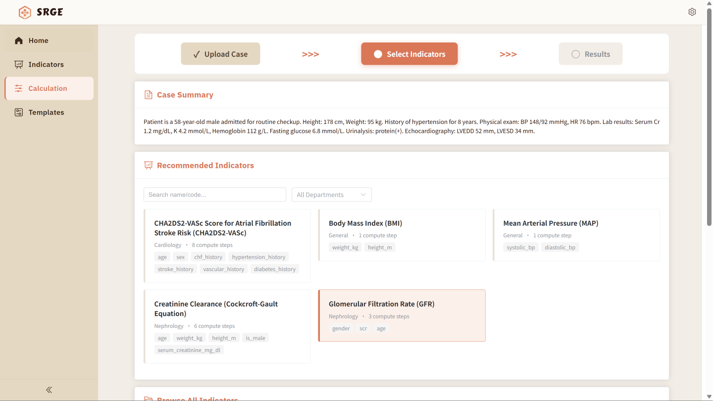

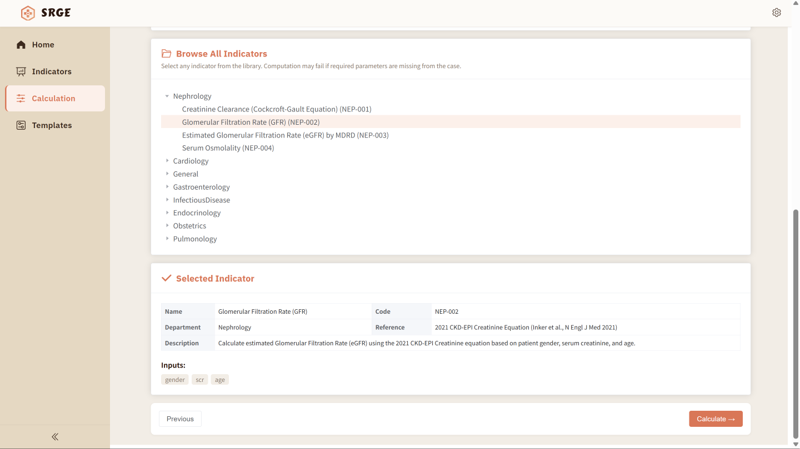

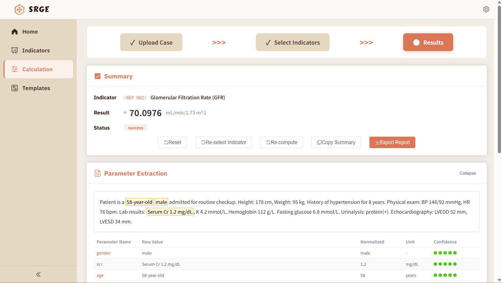

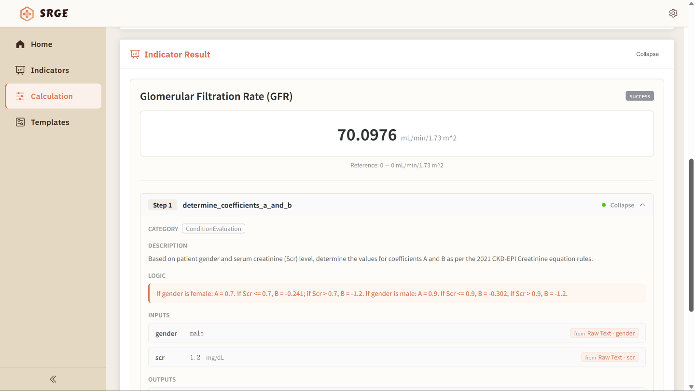

## Module 3: Templates

**Templates** shows the built-in atomic tool template library, which contains **eight** templates. Each template is used in the step sequence of a calculation indicator. When creating a new indicator, the system uses these eight templates as categories to decompose the indicator question into steps. Each step is assigned the most suitable template, which defines the step’s calculation logic, input and output specifications, code implementation, and other key constraints. These eight templates are embedded in the system’s algorithm and are shown here only as reference information.

Click **Expand** to view the details of a template, including its name, description, applicable scope, input and output specifications, and examples.

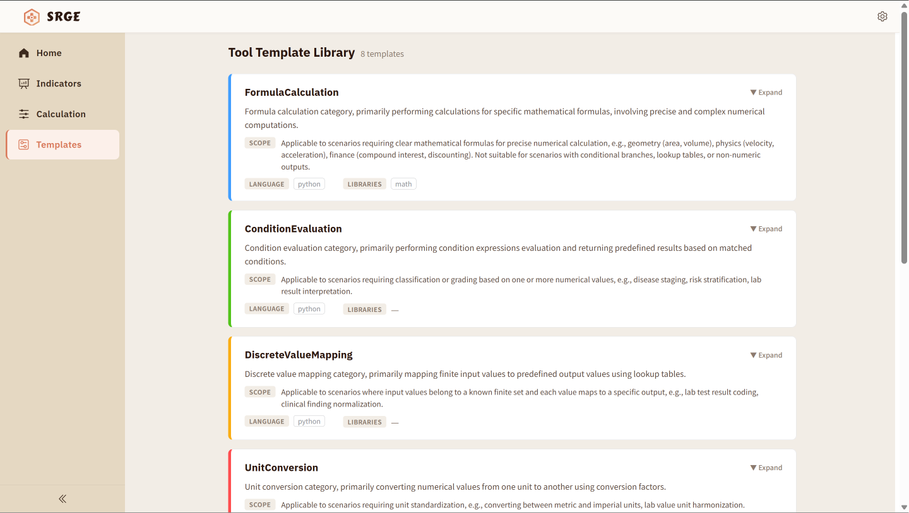

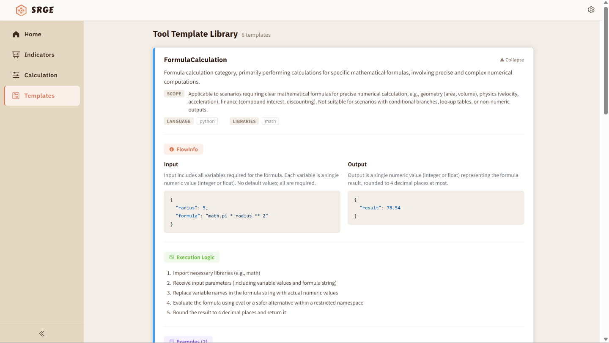
